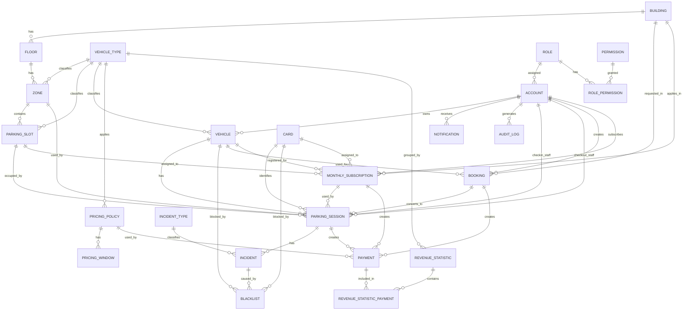

# 8. Concept, Entity & Physical Model

## 8.1 Modeling Scope

Phần này đồng bộ SRS với concept relationship, entity list và physical table model. Mục tiêu là để nghiệp vụ, ERD và thiết kế database không bị tách rời.

Các quyết định đã chốt trong SRS được phản ánh trong model:

- Booking phải chọn `Building` trước.
- Booking xe máy và ô tô chỉ chọn `Building` và Vehicle/biển số; Driver không chọn `Zone` hoặc `Slot`.
- Actual Zone được gợi ý khi check-in; Slot ô tô Walk-in/Booking được ghi nhận vào `parking_session.slot_id` sau khi xe thực tế đã đậu và vị trí được xác nhận.
- Ô tô Walk-in/Booking khi check-in chỉ được gợi ý Zone thuộc nhóm `GENERAL`, không được gán Slot ngay tại thời điểm hệ thống gợi ý vị trí.
- Ô tô Monthly Subscription dùng Slot đã gán trong Zone `MONTHLY` thông qua `monthly_subscription.assigned_slot_id`.
- Deposit Fee bằng Base Price của block đầu tiên theo Booking Policy tại thời điểm Booking được tạo và thanh toán.
- Pricing Policy của Parking Session được xác định bằng Vehicle Type và `check_in_time`; không bắt buộc lưu `pricing_policy_id` trên Parking Session và không xác định lại tại check-out.
- Pricing Policy có phạm vi toàn hệ thống theo Vehicle Type trong phiên bản hiện tại; không có `building_id`.
- Check-in phải xác nhận có đúng một Pricing Policy hợp lệ cho Vehicle Type tại `check_in_time`; nếu không có Policy hợp lệ thì không tạo Parking Session.
- Payment phát sinh từ session hoặc Booking Deposit lưu `pricing_policy_id` của Policy thực sự được dùng để audit.
- Booking no-show dùng `checkin_grace_minutes` và chuyển sang `EXPIRED`.
- Mỗi Monthly Subscription chỉ áp dụng cho một xe, không dùng `max_registered_plate`.
- Monthly Subscription có trạng thái `PENDING` khi chờ thanh toán/kích hoạt.
- Card có `card_type = NORMAL | MONTHLY`; Card `MONTHLY` được gán cho Monthly Subscription nhưng quyền lợi tháng vẫn do Monthly Subscription hợp lệ quyết định.
- Parking Session bắt buộc có `card_id` trong scope hiện tại; `monthly_subscription_id` là optional và không được dùng đồng thời với `booking_id`.
- Mỗi Payment phải có đúng một nguồn nghiệp vụ chính: `session_id`, `booking_id` hoặc `monthly_subscription_id`.
- `check_out_time` được ghi nhận khi bắt đầu check-out; nếu Payment còn `PENDING`, session chưa `COMPLETED`; nếu check-out `FAILED`, `check_out_time` của lần thất bại bị hủy.
- Các biến pricing, timeout, grace period, penalty và rounding được cấu hình động ở tầng nghiệp vụ/application/admin configuration, không hard-code và không tạo thêm table riêng trong physical model hiện tại.

## 8.2 Entity Summary

| Entity/Table | Purpose |
|---|---|
| `role` | lưu vai trò của account. |
| `permission` | lưu quyền chức năng trong hệ thống. |
| `role_permission` | bảng trung gian cho quan hệ N-N giữa role và permission. |
| `account` | lưu tài khoản người dùng. Parking Staff được mô hình hóa bằng Account có Role phù hợp. |
| `building` | lưu tòa nhà gửi xe. |
| `floor` | lưu tầng thuộc tòa nhà. |
| `vehicle_type` | lưu loại phương tiện. |
| `zone` | lưu khu vực đỗ xe trong tầng. |
| `parking_slot` | lưu vị trí đỗ cụ thể; ô tô Walk-in/Booking ghi nhận Slot thực tế sau khi đậu, ô tô Monthly Subscription giữ Slot riêng trong Zone `MONTHLY`. |
| `vehicle` | lưu xe thuộc account. |
| `card` | lưu Card do bãi xe quản lý, gồm Card `NORMAL` cho Walk-in/Booking và Card `MONTHLY` gán dài hạn cho Monthly Subscription. |
| `parking_session` | lưu lượt gửi xe từ check-in đến check-out. |
| `incident_type` | lưu loại sự cố. |
| `incident` | lưu sự cố phát sinh trong session. |
| `blacklist` | lưu bản ghi chặn vehicle, card hoặc incident. |
| `booking` | lưu đặt chỗ trước. |
| `monthly_subscription` | lưu hồ sơ đăng ký và quyền lợi gửi xe định kỳ gắn với Vehicle, Building, Card `MONTHLY`, và Slot riêng nếu là ô tô. |
| `pricing_policy` | lưu chính sách giá theo loại xe. |
| `pricing_window` | lưu rule tính giá theo khung giờ. |
| `payment` | lưu giao dịch thanh toán từ parking session, booking hoặc monthly subscription. |
| `revenue_statistic` | lưu dữ liệu thống kê doanh thu. |
| `revenue_statistic_payment` | bảng nối để truy vết payment được aggregate vào revenue statistic. |
| `notification` | lưu thông báo gửi đến account. |
| `audit_log` | lưu log thao tác để truy vết. |

#### 8.3 Physical Model Normalized

> Mục tiêu: chỉnh sửa physical/logical model để AI CLI đọc được, bám theo relationship của `PBMS_Conceptual_Model.md`, đồng thời chuẩn hóa attribute/datatype từ các physical ERD đã cung cấp.

---

### 8.3.1 Modeling Rules

#### 8.3.1.1 Database-Agnostic Rule

File này không viết theo một database cụ thể.

Không dùng datatype đặc thù như:

- `nvarchar`
- `ntext`
- `bit`
- `boolean`
- `serial`
- `identity`

Các datatype trong tài liệu là kiểu trung lập để AI/Developer có thể map sang database cụ thể sau.

| Neutral Type | PostgreSQL Mapping | SQL Server Mapping | MySQL Mapping |
|---|---|---|---|
| `varchar(100)` | `varchar(100)` | `nvarchar(100)` nếu cần Unicode ở bước triển khai SQL Server | `varchar(100)` với charset UTF-8 |
| `int` | `integer` | `int` | `int` |
| `timestamp` | `timestamp` | `datetime2` | `datetime` |
| `decimal(18,2)` | `numeric(18,2)` | `decimal(18,2)` | `decimal(18,2)` |

---

#### 8.3.1.2 Naming Convention

| Item | Convention |
|---|---|
| Table name | `snake_case` |
| Column name | `snake_case` |
| Primary key | `<table_name>_id` hoặc tên ngắn đã rõ nghĩa |
| Foreign key | `<referenced_table>_id` |
| Status column | `varchar(20)` |
| Code column | `varchar(20)` hoặc `varchar(50)` |
| Name column | `varchar(50)` hoặc `varchar(100)` |
| Description / reason / message | `varchar(100)` |

---

#### 8.3.1.3 Allowed Data Types

| Data Type | Usage |
|---|---|
| `int` | ID, FK, number, count, flag 0/1 |
| `varchar(20)` | status, enum ngắn, short code, license plate, phone |
| `varchar(50)` | name ngắn, username, email ngắn, method, action |
| `varchar(100)` | description, reason, message, address, password hash, long name |
| `decimal(18,2)` | toàn bộ tiền, phí, doanh thu, số đo nếu cần |
| `date` | ngày |
| `time` | giờ trong ngày |
| `timestamp` | thời điểm đầy đủ ngày + giờ |

Quy ước chuẩn hóa:

- Tất cả số tiền dùng `decimal(18,2)`.
- Không tồn tại nhiều kiểu decimal khác nhau.
- Field `boolean`, `bit` trong ảnh được chuẩn hóa thành `int` với ý nghĩa `0/1`.
- Unicode được xử lý bằng database encoding, ví dụ UTF-8.

---

#### 8.3.1.4 Generic Constraints

| Constraint | Meaning |
|---|---|
| `PK` | Primary Key |
| `FK -> table.column` | Foreign Key |
| `NOT NULL` | Bắt buộc có dữ liệu |
| `NULL` | Cho phép rỗng |
| `UNIQUE` | Không được trùng |
| `AUTO GENERATED` | ID tự sinh / auto increase |
| `CHECK` | Ràng buộc nghiệp vụ logic |
| `DEFAULT` | Giá trị mặc định logic |

---

### 8.3.2 Relationship Summary From Conceptual Model

| ID | Relationship | Cardinality | Physical Direction |
|---|---|---|---|
| R-STR-001 | Parking Building has Floor | 1 - N | `floor.building_id -> building.building_id` |
| R-STR-002 | Floor has Zone | 1 - N | `zone.floor_id -> floor.floor_id` |
| R-STR-003 | Zone contains Parking Slot | 1 - 0..N | `parking_slot.zone_id -> zone.zone_id` |
| R-STR-004 | Vehicle Type classifies Parking Slot | 1 - 0..N | `parking_slot.vehicle_type_id -> vehicle_type.vehicle_type_id` |
| R-STR-005 | Vehicle Type classifies Vehicle | 1 - 0..N | `vehicle.vehicle_type_id -> vehicle_type.vehicle_type_id` |
| R-AUTH-001 | Role grants Permission | N - M | `role_permission(role_id, permission_id)` |
| R-AUTH-002 | Account assigned Role | N - 1 | `account.role_id -> role.role_id` |
| R-AUTH-003 | Account owns Vehicle | 1 - 0..N | `vehicle.account_id -> account.account_id` |
| R-AUTH-004 | Account receives Notification | 1 - 0..N | `notification.account_id -> account.account_id` |
| R-AUTH-005 | Account generates Audit Log | 1 - 0..N | `audit_log.account_id -> account.account_id` |
| R-OPS-001 | Vehicle has Parking Session | 1 - N | `parking_session.vehicle_id -> vehicle.vehicle_id` |
| R-OPS-002 | Card identifies Parking Session | 1 - N | `parking_session.card_id -> card.card_id` |
| R-OPS-003 | Parking Slot is used by Parking Session over time | Parking Slot 1 - 0..N Parking Session; Parking Session 0..1 Parking Slot | `parking_session.slot_id -> parking_slot.slot_id` |
| R-OPS-004 | Parking Staff handles Parking Session | 0..N - N | `parking_session.in_staff_id/out_staff_id -> account.account_id` |
| R-OPS-005 | Parking Session has Incident | 1 - 0..N | `incident.session_id -> parking_session.session_id` |
| R-OPS-006 | Blacklist blocks Vehicle | 1 - 0..N | `blacklist.vehicle_id -> vehicle.vehicle_id` |
| R-OPS-007 | Blacklist blocks Card | 1 - 0..N | `blacklist.card_id -> card.card_id` |
| R-OPS-008 | Blacklist blocks Incident | 1 - 0..N | `blacklist.incident_id -> incident.incident_id` |
| R-BOOK-001 | Account has Booking | 1 - 0..N | `booking.account_id -> account.account_id` |
| R-BOOK-002 | Vehicle is used by Booking | 1 - 0..N | `booking.vehicle_id -> vehicle.vehicle_id` |
| R-BOOK-003 | Booking is requested in Building | Building 1 - 0..N Booking | `booking.building_id -> building.building_id` |
| R-BOOK-004 | Booking creates Payment | 1 - 0..N | `payment.booking_id -> booking.booking_id`; Payment source must be exclusive |
| R-BOOK-005 | Booking converts to Parking Session | 0..1 - 1 | `parking_session.booking_id -> booking.booking_id` |
| R-MONTH-001 | Account subscribes Monthly Subscription | 1 - 0..N | `monthly_subscription.account_id -> account.account_id` |
| R-MONTH-002 | Vehicle registered in Monthly Subscription | 1 - 0..N | `monthly_subscription.vehicle_id -> vehicle.vehicle_id` |
| R-MONTH-003 | Monthly Subscription is assigned Card | Card 1 - 0..N Monthly Subscription | `monthly_subscription.assigned_card_id -> card.card_id` |
| R-MONTH-004 | Monthly Subscription includes Parking Slot for cars | Parking Slot 1 - 0..N Monthly Subscription | `monthly_subscription.assigned_slot_id -> parking_slot.slot_id` |
| R-MONTH-005 | Monthly Subscription creates Payment | 1 - 0..N | `payment.monthly_subscription_id -> monthly_subscription.monthly_subscription_id`; Payment source must be exclusive |
| R-MONTH-006 | Monthly Subscription has Parking Session | 1 - 0..N | `parking_session.monthly_subscription_id -> monthly_subscription.monthly_subscription_id` |
| R-PAY-001 | Parking Session creates Payment | 1 - 0..N | `payment.session_id -> parking_session.session_id`; Payment source must be exclusive |
| R-PAY-003 | Revenue Statistic aggregates Payment | 1 - N | `revenue_statistic_payment(statistic_id, payment_id)` |
| R-PRICE-001 | Vehicle Type applies Pricing Policy | 1 - 0..N | `pricing_policy.vehicle_type_id -> vehicle_type.vehicle_type_id` |
| R-PRICE-002 | Pricing Policy applies Payment | 1 - 0..N | `payment.pricing_policy_id -> pricing_policy.pricing_policy_id` |
| R-PRICE-003 | Pricing Policy has Pricing Window | 1 - 1..N | `pricing_window.pricing_policy_id -> pricing_policy.pricing_policy_id` |

---

### 8.3.3 Physical Tables

#### 3.1 `role`

Purpose: lưu vai trò của account.

| Column | Type | Constraints | Meaning |
|---|---|---|---|
| role_id | int | PK, AUTO GENERATED, NOT NULL | ID vai trò |
| role_name | varchar(50) | NOT NULL, UNIQUE | Tên vai trò |
| description | varchar(100) | NULL | Mô tả vai trò |

---

#### 3.2 `permission`

Purpose: lưu quyền chức năng trong hệ thống.

| Column | Type | Constraints | Meaning |
|---|---|---|---|
| permission_id | int | PK, AUTO GENERATED, NOT NULL | ID quyền |
| permission_code | varchar(50) | NOT NULL, UNIQUE | Mã quyền |
| permission_name | varchar(50) | NOT NULL | Tên quyền |
| description | varchar(100) | NULL | Mô tả quyền |
| permission_status | varchar(20) | NOT NULL | Trạng thái quyền |

---

#### 3.3 `role_permission`

Purpose: bảng trung gian cho quan hệ N-N giữa role và permission.

| Column | Type | Constraints | Meaning |
|---|---|---|---|
| role_id | int | PK, FK -> role.role_id, NOT NULL | Vai trò |
| permission_id | int | PK, FK -> permission.permission_id, NOT NULL | Quyền |

---

#### 3.4 `account`

Purpose: lưu tài khoản người dùng. Parking Staff được mô hình hóa bằng Account có Role phù hợp.

| Column | Type | Constraints | Meaning |
|---|---|---|---|
| account_id | int | PK, AUTO GENERATED, NOT NULL | ID tài khoản |
| role_id | int | FK -> role.role_id, NOT NULL | Vai trò chính của tài khoản |
| username | varchar(50) | NOT NULL, UNIQUE | Tên đăng nhập |
| password_hash | varchar(100) | NOT NULL | Mật khẩu đã hash |
| full_name | varchar(100) | NULL | Họ tên |
| email | varchar(100) | NULL, UNIQUE | Email |
| phone | varchar(20) | NULL | Số điện thoại |
| account_status | varchar(20) | NOT NULL | Trạng thái tài khoản |
| created_at | timestamp | NOT NULL | Thời điểm tạo |

---

#### 3.5 `building`

Purpose: lưu tòa nhà gửi xe.

| Column | Type | Constraints | Meaning |
|---|---|---|---|
| building_id | int | PK, AUTO GENERATED, NOT NULL | ID tòa nhà |
| building_name | varchar(50) | NOT NULL | Tên tòa nhà |
| address | varchar(100) | NULL | Địa chỉ |
| total_floor | int | NOT NULL | Tổng số tầng |
| building_status | varchar(20) | NOT NULL | Trạng thái tòa nhà |
| created_at | timestamp | NOT NULL | Thời điểm tạo |

---

#### 3.6 `floor`

Purpose: lưu tầng thuộc tòa nhà.

| Column | Type | Constraints | Meaning |
|---|---|---|---|
| floor_id | int | PK, AUTO GENERATED, NOT NULL | ID tầng |
| building_id | int | FK -> building.building_id, NOT NULL | Tòa nhà chứa tầng |
| floor_number | int | NOT NULL | Số tầng |
| floor_name | varchar(50) | NULL | Tên tầng |
| floor_status | varchar(20) | NOT NULL | Trạng thái tầng |

Generic constraints:

- `UNIQUE(building_id, floor_number)`

---

#### 3.7 `zone`

Purpose: lưu khu vực đỗ xe trong tầng.

| Column | Type | Constraints | Meaning |
|---|---|---|---|
| zone_id | int | PK, AUTO GENERATED, NOT NULL | ID zone |
| floor_id | int | FK -> floor.floor_id, NOT NULL | Tầng chứa zone |
| vehicle_type_id | int | FK -> vehicle_type.vehicle_type_id, NOT NULL | Loại xe được phục vụ |
| zone_code | varchar(20) | NOT NULL | Mã zone |
| zone_name | varchar(50) | NOT NULL | Tên zone |
| capacity | int | NOT NULL | Sức chứa zone |
| zone_access_type | varchar(20) | NOT NULL, DEFAULT `GENERAL` | GENERAL, MONTHLY |
| zone_status | varchar(20) | NOT NULL | Trạng thái zone |

Generic constraints:

- `UNIQUE(floor_id, zone_code)`
- `CHECK(capacity >= 0)`
- `zone_access_type` dùng để tách Zone ô tô `GENERAL` cho Walk-in/Booking và `MONTHLY` cho Monthly Subscription.
- Motorcycle monthly capacity không yêu cầu Zone `MONTHLY`; mỗi subscription active giữ một đơn vị capacity động ở Building.

---

#### 3.8 `parking_slot`

Purpose: lưu vị trí đỗ cụ thể. Ô tô Walk-in/Booking chỉ ghi nhận Slot sau khi xe thực tế đã đậu; ô tô thẻ tháng giữ Slot riêng qua `monthly_subscription.assigned_slot_id`.

| Column | Type | Constraints | Meaning |
|---|---|---|---|
| slot_id | int | PK, AUTO GENERATED, NOT NULL | ID slot |
| zone_id | int | FK -> zone.zone_id, NOT NULL | Zone chứa slot |
| vehicle_type_id | int | FK -> vehicle_type.vehicle_type_id, NOT NULL | Loại xe phù hợp |
| slot_code | varchar(20) | NOT NULL, UNIQUE | Mã slot |
| slot_name | varchar(50) | NULL | Tên hiển thị |
| slot_status | varchar(20) | NOT NULL | AVAILABLE, OCCUPIED, BLOCKED, MAINTENANCE |
| created_at | timestamp | NOT NULL | Thời điểm tạo |

Generic constraints:

- Một slot không được có nhiều active parking session cùng lúc.
- Ô tô Walk-in/Booking chỉ được ghi nhận Slot thực tế trong Zone `GENERAL` sau khi xe đã đậu; không gán Slot tại thời điểm hệ thống gợi ý vị trí.
- Ô tô thẻ tháng dùng Slot trong Zone `MONTHLY` thông qua `monthly_subscription.assigned_slot_id`.
- Không dùng `slot_status` để biểu diễn Slot đã gán dài hạn cho Monthly Subscription.

---

#### 3.9 `vehicle_type`

Purpose: lưu loại phương tiện.

| Column | Type | Constraints | Meaning |
|---|---|---|---|
| vehicle_type_id | int | PK, AUTO GENERATED, NOT NULL | ID loại xe |
| type_name | varchar(50) | NOT NULL, UNIQUE | Tên loại xe |
| description | varchar(100) | NULL | Mô tả |
| vehicle_type_status | varchar(20) | NOT NULL | Trạng thái loại xe |

---

#### 3.10 `vehicle`

Purpose: lưu xe thuộc account.

| Column | Type | Constraints | Meaning |
|---|---|---|---|
| vehicle_id | int | PK, AUTO GENERATED, NOT NULL | ID xe |
| account_id | int | FK -> account.account_id, NULL | Chủ xe; nullable vì có thể nhập xe trước hoặc khách vãng lai |
| vehicle_type_id | int | FK -> vehicle_type.vehicle_type_id, NOT NULL | Loại xe |
| license_plate | varchar(20) | NOT NULL, UNIQUE | Biển số xe |
| registered_day | date | NULL | Ngày đăng ký xe trong hệ thống |
| vehicle_status | varchar(20) | NOT NULL | Trạng thái xe trên hệ thống |

---

#### 3.11 `card`

Purpose: lưu Card do bãi xe quản lý. Card `NORMAL` được cấp tạm thời cho Walk-in/Booking; Card `MONTHLY` được gán dài hạn cho Monthly Subscription và Driver giữ trong thời hạn quyền lợi.

| Column | Type | Constraints | Meaning |
|---|---|---|---|
| card_id | int | PK, AUTO GENERATED, NOT NULL | ID card |
| card_code | varchar(20) | NOT NULL, UNIQUE | Mã nghiệp vụ để Staff nhập thủ công, ví dụ `CARD-000001` |
| nfc_uid | varchar(50) | NULL, UNIQUE WHEN NOT NULL | UID của chip NFC nếu Card đã được gắn NFC |
| card_type | varchar(20) | NOT NULL | NORMAL, MONTHLY |
| card_status | varchar(20) | NOT NULL, DEFAULT `AVAILABLE` | AVAILABLE, ASSIGNED, LOST, BLOCKED |
| created_at | timestamp | NOT NULL | Thời điểm tạo Card |
| updated_at | timestamp | NULL | Thời điểm cập nhật cuối |

Generic constraints:

- `card_code` phải được sinh tự động theo format thống nhất, ví dụ `CARD-000001`, và không dùng `COUNT + 1` khi có nguy cơ trùng do concurrent request.
- `nfc_uid` được phép `NULL`; khi có giá trị thì phải duy nhất.
- Một Card chỉ được gắn với tối đa một Parking Session `ACTIVE`.
- Card `NORMAL` chỉ dùng cho Walk-in/Booking, chuyển `AVAILABLE -> ASSIGNED -> AVAILABLE`.
- Card `MONTHLY` được gán qua `monthly_subscription.assigned_card_id`, giữ trạng thái `ASSIGNED` qua nhiều lượt check-in/check-out.
- Card type không tự cấp quyền lợi Monthly Subscription; quyền lợi phụ thuộc vào Monthly Subscription hợp lệ.

---

#### 3.12 `parking_session`

Purpose: lưu lượt gửi xe từ check-in đến check-out.

| Column | Type | Constraints | Meaning |
|---|---|---|---|
| session_id | int | PK, AUTO GENERATED, NOT NULL | ID session |
| vehicle_id | int | FK -> vehicle.vehicle_id, NOT NULL | Xe gửi |
| building_id | int | FK -> building.building_id, NOT NULL | Building nơi session diễn ra |
| card_id | int | FK -> card.card_id, NOT NULL | Card được dùng để nhận diện session |
| zone_id | int | FK -> zone.zone_id, NULL | Zone được gợi ý hoặc sử dụng |
| slot_id | int | FK -> parking_slot.slot_id, NULL | Slot thực tế được dùng nếu có; nullable cho xe máy và cho ô tô Walk-in/Booking trong giai đoạn check-in/chờ xác nhận vị trí đậu |
| booking_id | int | FK -> booking.booking_id, NULL, UNIQUE | Booking chuyển thành session |
| monthly_subscription_id | int | FK -> monthly_subscription.monthly_subscription_id, NULL | Quyền lợi Monthly Subscription được áp dụng nếu có |
| in_staff_id | int | FK -> account.account_id, NULL | Staff xử lý check-in |
| out_staff_id | int | FK -> account.account_id, NULL | Staff xử lý check-out |
| check_in_time | timestamp | NOT NULL | Thời điểm vào |
| check_out_time | timestamp | NULL | Thời điểm check-out được ghi nhận ngay khi Driver/Staff bắt đầu check-out; dùng làm mốc kết thúc tính phí nếu cùng quá trình check-out tiếp tục |
| license_plate_in | varchar(20) | NOT NULL | Biển số lúc vào |
| license_plate_out | varchar(20) | NULL | Biển số lúc ra |
| session_status | varchar(20) | NOT NULL | Trạng thái vòng đời lượt gửi xe |

Generic constraints:

- Một `vehicle_id` chỉ được có tối đa một session `ACTIVE` cùng lúc.
- Một `card_id` chỉ được có tối đa một session `ACTIVE` cùng lúc.
- Parking Session không bắt buộc lưu `pricing_policy_id`; Policy áp dụng được xác định bằng `parking_session.vehicle_id -> vehicle.vehicle_type_id` và `parking_session.check_in_time`.
- Check-in chỉ tạo Parking Session khi có đúng một Pricing Policy hợp lệ cho Vehicle Type tại `check_in_time`.
- Payment phát sinh từ session phải lưu `payment.pricing_policy_id` của Policy đã thực sự dùng để tính phí sau khi Fee Calculation hoàn tất.
- Một `slot_id` chỉ được có tối đa một session `ACTIVE` cùng lúc.
- `booking_id` unique vì một booking chỉ được chuyển thành tối đa một session.
- `booking_id` và `monthly_subscription_id` không được đồng thời có giá trị.
- Xe máy có thể `slot_id = NULL` và dùng `zone_id`.
- Ô tô Walk-in/Booking có thể `slot_id = NULL` trong giai đoạn check-in hoặc đang chờ xác nhận vị trí đậu; sau khi xe đã đậu, `slot_id` phải được cập nhật.
- Slot thực tế của ô tô Walk-in/Booking phải thuộc Zone `GENERAL` đã được phân bổ, phù hợp loại xe, không bị khóa/bảo trì và chưa có xe khác chiếm dụng.
- Ô tô Monthly Subscription phải dùng `slot_id = monthly_subscription.assigned_slot_id` thuộc Zone `MONTHLY`.
- Monthly Subscription chỉ áp dụng khi `parking_session.building_id = monthly_subscription.building_id`.
- Sau khi `check_out_time` được ghi nhận nhưng Payment còn `PENDING`, session chưa `COMPLETED`, xe vẫn được xem là còn trong bãi, Zone/Slot/Card chưa được giải phóng và phí không tăng thêm trong cùng quá trình thanh toán.
- Nếu check-out `FAILED` hoặc bị hủy, `check_out_time` của lần thất bại bị hủy; session tiếp tục ở trạng thái đang gửi và lần check-out sau ghi nhận mốc mới.

---

#### 3.13 `incident_type`

Purpose: lưu loại sự cố.

| Column | Type | Constraints | Meaning |
|---|---|---|---|
| incident_type_id | int | PK, AUTO GENERATED, NOT NULL | ID loại sự cố |
| incident_code | varchar(20) | NOT NULL, UNIQUE | Mã loại sự cố |
| incident_name | varchar(50) | NOT NULL | Tên loại sự cố |
| description | varchar(100) | NULL | Mô tả |
| default_penalty_fee | decimal(18,2) | NULL | Phí phạt mặc định |

---

#### 3.14 `incident`

Purpose: lưu sự cố phát sinh trong session.

| Column | Type | Constraints | Meaning |
|---|---|---|---|
| incident_id | int | PK, AUTO GENERATED, NOT NULL | ID sự cố |
| session_id | int | FK -> parking_session.session_id, NOT NULL | Session phát sinh sự cố |
| incident_type_id | int | FK -> incident_type.incident_type_id, NOT NULL | Loại sự cố |
| description | varchar(100) | NULL | Mô tả |
| penalty_fee | decimal(18,2) | NULL | Phí phạt |
| incident_status | varchar(20) | NOT NULL | Trạng thái incident |
| created_at | timestamp | NOT NULL | Thời điểm tạo |
| resolved_at | timestamp | NULL | Thời điểm xử lý xong |

---

#### 3.15 `blacklist`

Purpose: lưu bản ghi chặn vehicle, card hoặc incident.

| Column | Type | Constraints | Meaning |
|---|---|---|---|
| blacklist_id | int | PK, AUTO GENERATED, NOT NULL | ID blacklist |
| vehicle_id | int | FK -> vehicle.vehicle_id, NULL | Xe bị chặn |
| card_id | int | FK -> card.card_id, NULL | Card bị chặn |
| incident_id | int | FK -> incident.incident_id, NULL | Sự cố dẫn tới blacklist |
| reason | varchar(100) | NOT NULL | Lý do chặn |
| created_at | timestamp | NOT NULL | Thời điểm tạo |

Generic constraints:

- `CHECK(vehicle_id IS NOT NULL OR card_id IS NOT NULL OR incident_id IS NOT NULL)`

---

#### 3.16 `booking`

Purpose: lưu đặt chỗ trước.

| Column | Type | Constraints | Meaning |
|---|---|---|---|
| booking_id | int | PK, AUTO GENERATED, NOT NULL | ID booking |
| account_id | int | FK -> account.account_id, NOT NULL | Người tạo booking |
| vehicle_id | int | FK -> vehicle.vehicle_id, NOT NULL | Xe được booking |
| vehicle_type_id | int | FK -> vehicle_type.vehicle_type_id, NOT NULL | Loại xe tại thời điểm booking |
| building_id | int | FK -> building.building_id, NOT NULL | Tòa nhà booking |
| planned_checkin_time | timestamp | NOT NULL | Giờ dự kiến vào |
| planned_checkout_time | timestamp | NOT NULL | Giờ dự kiến ra |
| deposit_amount | decimal(18,2) | NOT NULL | Deposit Fee bằng Base Price của block đầu tiên theo Booking Policy tại thời điểm Booking được tạo |
| booking_status | varchar(20) | NOT NULL | Trạng thái quy trình booking. |
| payment_deadline | timestamp | NOT NULL | Hạn thanh toán cọc |
| checkin_grace_until | timestamp | NOT NULL | Hạn check-in sau grace time |
| cancelled_at | timestamp | NULL | Thời điểm hủy |
| cancel_reason | varchar(100) | NULL | Lý do hủy |
| confirmed_at | timestamp | NULL | Thời điểm xác nhận |
| created_at | timestamp | NOT NULL | Thời điểm tạo |

Generic constraints:

- Booking phải có `building_id`, Vehicle/biển số và planned time.
- Booking không lưu Driver-selected `zone_id` hoặc `slot_id` và không giữ Zone/Slot cụ thể.
- Xe máy booking giữ một general capacity unit tại Building; actual Zone được lưu ở `parking_session.zone_id` khi check-in.
- Ô tô booking giữ general car capacity tại Building; Zone `GENERAL` được gợi ý khi check-in và actual Slot được lưu ở `parking_session.slot_id` sau khi xe đã đậu.
- Với booking ô tô đã `CONFIRMED`, Slot chưa nằm trong Booking; hệ thống không cập nhật `slot_status` khi tạo Booking, timeout hoặc no-show.
- `planned_checkout_time` phải sau `planned_checkin_time`.
- Một booking chỉ được chuyển thành tối đa một parking session.
- Nếu hết `payment_deadline` mà chưa thanh toán, booking hết hiệu lực hoặc bị hủy theo status model; general capacity đã tạm giữ được giải phóng và không cập nhật `slot_status`.
- Nếu quá `checkin_grace_until` mà chưa check-in, booking chuyển `EXPIRED` do no-show, Deposit Fee không hoàn, general capacity được giải phóng và không cập nhật `slot_status`.

---

#### 3.17 `monthly_subscription`

Purpose: lưu hồ sơ đăng ký gửi xe định kỳ, chu kỳ hiệu lực và quyền lợi tháng của một Vehicle trên hệ thống; không đại diện cho Card vật lý hoặc dữ liệu được lưu trong chip NFC.

| Column | Type | Constraints | Meaning |
|---|---|---|---|
| monthly_subscription_id | int | PK, AUTO GENERATED, NOT NULL | ID hồ sơ đăng ký gửi xe tháng |
| account_id | int | FK -> account.account_id, NOT NULL | Người đăng ký |
| vehicle_id | int | FK -> vehicle.vehicle_id, NOT NULL | Xe được áp dụng quyền lợi |
| assigned_card_id | int | FK -> card.card_id, NULL, UNIQUE | Card `MONTHLY` cấp cho Driver |
| assigned_slot_id | int | FK -> parking_slot.slot_id, NULL | Slot riêng của ô tô Monthly Subscription |
| building_id | int | FK -> building.building_id, NOT NULL | Tòa nhà áp dụng |
| monthly_price | decimal(18,2) | NOT NULL | Giá tại thời điểm đăng ký |
| activated_at | timestamp | NULL | Thời điểm kích hoạt sau khi thanh toán thành công |
| expired_at | timestamp | NULL | Thời điểm hết hiệu lực |
| monthly_subscription_status | varchar(20) | NOT NULL, DEFAULT `PENDING` | PENDING, ACTIVE, EXPIRED, DOWNGRADED, CANCELLED |
| created_at | timestamp | NOT NULL | Thời điểm tạo hồ sơ |

Generic constraints:

- `monthly_price >= 0`.
- Nếu có cả `activated_at` và `expired_at` thì `expired_at > activated_at`.
- Xe máy Monthly Subscription phải có `assigned_slot_id = NULL`.
- Ô tô Monthly Subscription phải có `assigned_slot_id` trước khi quyền lợi được kích hoạt.
- `assigned_card_id` phải trỏ tới Card có `card_type = MONTHLY` và `card_status = ASSIGNED` khi subscription active.
- Slot ô tô Monthly Subscription phải thuộc cùng Building thông qua `assigned_slot -> zone -> floor -> building`.
- Slot ô tô Monthly Subscription phải thuộc Zone có `zone_access_type = MONTHLY`.
- Mỗi Monthly Subscription chỉ áp dụng cho một `vehicle_id`.
- Một xe không được có nhiều Monthly Subscription `ACTIVE` trùng thời gian hiệu lực.
- Monthly Subscription ở trạng thái `PENDING` khi chờ thanh toán/kích hoạt; khi đó `activated_at` và `expired_at` có thể `NULL`.
- Card `MONTHLY` có thể được giữ bởi Driver qua nhiều lượt check-in/check-out; Card type không thay thế validation Monthly Subscription.

---

#### 3.18 `pricing_policy`

Purpose: lưu chính sách giá theo loại xe. Trong phiên bản hiện tại, Pricing Policy có phạm vi toàn hệ thống theo Vehicle Type và không cấu hình riêng theo Building.

| Column | Type | Constraints | Meaning |
|---|---|---|---|
| pricing_policy_id | int | PK, AUTO GENERATED, NOT NULL | ID chính sách giá |
| vehicle_type_id | int | FK -> vehicle_type.vehicle_type_id, NOT NULL | Loại xe áp dụng |
| policy_name | varchar(100) | NOT NULL | Tên chính sách |
| effective_start | date | NOT NULL | Ngày bắt đầu hiệu lực |
| effective_end | date | NULL | Ngày hết hiệu lực |
| pricing_policy_status | varchar(20) | NOT NULL | Trạng thái chính sách |

Generic constraints:

- `effective_end` phải null hoặc sau `effective_start`.
- Mỗi policy có ít nhất một pricing window.
- `pricing_policy` không có `building_id`; tất cả Building dùng chung policy đang áp dụng cho Vehicle Type tương ứng.
- Các Policy cùng `vehicle_type_id` không được overlap khoảng `effective_start` - `effective_end`; thời điểm kết thúc Policy trước có thể bằng thời điểm bắt đầu Policy sau và tại thời điểm chuyển tiếp chỉ Policy mới được áp dụng.
- Có thể tồn tại khoảng trống giữa hai Policy; check-in trong khoảng trống bị từ chối và hệ thống không tự động dùng Policy gần nhất, Policy đã hết hạn, Policy tương lai, giá mặc định hoặc Policy của Vehicle Type khác.
- Policy đã `ACTIVE` hoặc đã từng được dùng để chấp nhận Parking Session không được sửa Vehicle Type, Pricing Window, Base Duration, Base Price, Increment Block, Increment Price, Grace Period, Window Cap hoặc dữ liệu làm thay đổi kết quả tính phí.
- Policy đã được Parking Session hoặc Payment sử dụng không được xóa trực tiếp; Policy lịch sử phải được giữ lại để audit.
- `effective_start` của Policy `ACTIVE` không được sửa. Policy tương lai có thể đổi `effective_start` nếu thời điểm mới vẫn trong tương lai, không overlap và Policy chưa được dùng.
- `effective_end` của Policy tương lai hoặc `ACTIVE` có thể sửa nếu mốc mới nằm trong tương lai, không overlap, không làm mất hiệu lực hồi tố với session đã check-in và không thay đổi cấu hình giá/Pricing Window. Policy `EXPIRED` không được đổi `effective_end`.

---

#### 3.19 `pricing_window`

Purpose: lưu rule tính giá theo khung giờ.

| Column | Type | Constraints | Meaning |
|---|---|---|---|
| pricing_window_id | int | PK, AUTO GENERATED, NOT NULL | ID pricing window |
| pricing_policy_id | int | FK -> pricing_policy.pricing_policy_id, NOT NULL | Chính sách giá cha |
| window_name | varchar(50) | NOT NULL | Tên khung giờ |
| start_time | time | NOT NULL | Giờ bắt đầu |
| end_time | time | NOT NULL | Giờ kết thúc |
| base_duration_minutes | int | NOT NULL | Thời lượng cơ bản |
| base_price | decimal(18,2) | NOT NULL | Giá cơ bản |
| increment_block_minutes | int | NOT NULL | Kích thước block phát sinh |
| increment_price | decimal(18,2) | NOT NULL | Giá mỗi block phát sinh |
| window_cap | decimal(18,2) | NULL | Mức giá tối đa của window |
| grace_period_minutes | int | NOT NULL, DEFAULT 0 | Thời gian ân hạn |

Generic constraints:

- `base_duration_minutes > 0`
- `increment_block_minutes > 0`
- `base_price >= 0`
- `increment_price >= 0`
- `window_cap` null hoặc `window_cap >= base_price`
- Window cap chỉ áp dụng trong từng pricing window, không áp dụng toàn session.
- Window có `start_time` lớn hơn `end_time` được hiểu là Window đi qua nửa đêm.
- Tất cả Pricing Window trong cùng Policy phải không overlap và phủ đủ 24 giờ; không được tồn tại khoảng thời gian không thuộc Window nào.
- Một thời điểm chỉ thuộc đúng một Pricing Window.
- Hệ thống không cho kích hoạt Pricing Policy nếu Pricing Window overlap hoặc không phủ đủ 24 giờ.
- Mỗi lần xuất hiện của Pricing Window trong từng ngày được tính riêng; Base Price, Increment Block, Grace Period và Window Cap bắt đầu lại cho từng đoạn.
- Nếu một đoạn trong Pricing Window có thời lượng lớn hơn 0, đoạn đó chịu ít nhất Base Price của Window tương ứng.
- Grace Period chỉ áp dụng cho phần dư sau các Increment Block đầy đủ, không loại bỏ Base Price.
- Thời điểm bắt đầu Window thuộc Window đó; thời điểm kết thúc Window thuộc Window tiếp theo; đoạn thời lượng bằng 0 không tính phí.

---

#### 3.20 `payment`

Purpose: lưu giao dịch thanh toán từ đúng một nguồn nghiệp vụ chính: parking session, booking hoặc monthly subscription.

| Column | Type | Constraints | Meaning |
|---|---|---|---|
| payment_id | int | PK, AUTO GENERATED, NOT NULL | ID payment |
| session_id | int | FK -> parking_session.session_id, NULL | Payment từ session |
| booking_id | int | FK -> booking.booking_id, NULL | Payment từ booking |
| monthly_subscription_id | int | FK -> monthly_subscription.monthly_subscription_id, NULL | Payment từ monthly subscription |
| pricing_policy_id | int | FK -> pricing_policy.pricing_policy_id, NULL | Chính sách giá dùng để tính |
| amount | decimal(18,2) | NOT NULL | Số tiền |
| payment_method | varchar(20) | NOT NULL | CASH, ONLINE_BANKING |
| payment_time | timestamp | NULL | Thời điểm thanh toán |
| payment_status | varchar(20) | NOT NULL | PENDING, PAID, FAILED, REFUNDED |
| created_at | timestamp | NOT NULL | Thời điểm tạo payment |

Generic constraints:

- `PENDING` nghĩa là quy trình thanh toán còn mở; một lần thử giao dịch bị từ chối không nhất thiết chuyển Payment sang `FAILED`.
- `FAILED` chỉ dùng khi quy trình thanh toán đã kết thúc không thành công.
- `PAID` chỉ dùng khi ngân hàng hoặc Staff xác nhận đã nhận tiền.
- `amount >= 0`; hệ thống không tạo Payment âm.
- Mỗi Payment phải có đúng một trong ba FK `session_id`, `booking_id`, `monthly_subscription_id` khác `NULL`.
- Database-agnostic constraint: `COUNT_NON_NULL(session_id, booking_id, monthly_subscription_id) = 1`.
- SQL minh họa:
  ```sql
  CHECK (
      (CASE WHEN session_id IS NOT NULL THEN 1 ELSE 0 END) +
      (CASE WHEN booking_id IS NOT NULL THEN 1 ELSE 0 END) +
      (CASE WHEN monthly_subscription_id IS NOT NULL THEN 1 ELSE 0 END)
      = 1
  )
  ```
- Booking Deposit Payment chỉ có `booking_id`.
- Monthly Subscription Purchase/Renewal Payment chỉ có `monthly_subscription_id`.
- Parking Fee hoặc checkout penalty Payment chỉ có `session_id`.
- Booking Deposit Payment phải lưu `pricing_policy_id` của Booking Policy tại thời điểm Booking được tạo và thanh toán.
- Với Payment phát sinh từ Parking Session, `payment.pricing_policy_id` là Policy được xác định bằng Vehicle Type và `check_in_time` của Parking Session rồi dùng để tính phí.
- Payment `FAILED` được giữ để audit, không bị xóa khi rollback nghiệp vụ của lần check-out.
- Payment đã `FAILED` không được đổi ngược về `PENDING`; lần thử lại tạo Payment mới.
- Không được có hai Payment `PAID` cho cùng một nghĩa vụ thanh toán.
- Nếu Booking Deposit lớn hơn Tổng phí thực tế khi check-out, không tạo Payment cho phần chênh lệch và không thay đổi Deposit Payment đã tồn tại.
- Checkout Payment không có automatic timeout; Booking Payment dùng `booking_payment_timeout_minutes`, Monthly Subscription Payment dùng `monthly_subscription_payment_timeout_minutes`.
- Payment nên lưu pricing policy hoặc fee detail để audit khi bảng giá thay đổi.

---

#### 3.21 `revenue_statistic`

Purpose: lưu dữ liệu thống kê doanh thu.

| Column | Type | Constraints | Meaning |
|---|---|---|---|
| statistic_id | int | PK, AUTO GENERATED, NOT NULL | ID thống kê |
| stat_date | date | NOT NULL | Ngày thống kê |
| vehicle_type_id | int | FK -> vehicle_type.vehicle_type_id, NULL | Loại xe nếu thống kê theo loại |
| payment_method | varchar(20) | NULL | Phương thức thanh toán dùng như dimension thống kê |
| total_payments_count | int | NOT NULL | Tổng số payment trong nhóm thống kê |
| total_revenue | decimal(18,2) | NOT NULL | Tổng doanh thu |
| updated_at | timestamp | NOT NULL | Thời điểm cập nhật |

Generic constraints:

- `payment_method` là giá trị grouping/snapshot từ `payment.payment_method`, không phải FK vì `payment_method` không phải entity riêng.
- Nếu cần truy vết payment nào nằm trong statistic nào, dùng bảng nối `revenue_statistic_payment`.
- Statistic có thể được tạo từ query, job tổng hợp hoặc materialized data.

---

#### 3.22 `revenue_statistic_payment`

Purpose: bảng nối để truy vết payment được aggregate vào revenue statistic.

| Column | Type | Constraints | Meaning |
|---|---|---|---|
| statistic_id | int | PK, FK -> revenue_statistic.statistic_id, NOT NULL | Dòng thống kê |
| payment_id | int | PK, FK -> payment.payment_id, NOT NULL | Payment được tổng hợp |

Generic constraints:

- Một `revenue_statistic` có thể aggregate nhiều `payment`.
- Một `payment` có thể xuất hiện trong nhiều statistic khác nhau nếu hệ thống tạo nhiều kiểu thống kê, ví dụ theo ngày, theo loại xe, theo phương thức thanh toán.

---

#### 3.23 `notification`

Purpose: lưu thông báo gửi đến account.

| Column | Type | Constraints | Meaning |
|---|---|---|---|
| notification_id | int | PK, AUTO GENERATED, NOT NULL | ID thông báo |
| account_id | int | FK -> account.account_id, NOT NULL | Người nhận |
| title | varchar(100) | NOT NULL | Tiêu đề |
| message | varchar(100) | NOT NULL | Nội dung |

---

#### 3.24 `audit_log`

Purpose: lưu log thao tác để truy vết.

| Column | Type | Constraints | Meaning |
|---|---|---|---|
| audit_log_id | int | PK, AUTO GENERATED, NOT NULL | ID log |
| account_id | int | FK -> account.account_id, NULL | Người thực hiện |
| action | varchar(50) | NOT NULL | Hành động |
| target_table | varchar(50) | NULL | Bảng/entity bị tác động |
| target_id | int | NULL | ID bản ghi bị tác động |
| description | varchar(100) | NULL | Mô tả |
| created_at | timestamp | NOT NULL | Thời điểm ghi log |

---

### 8.3.4 Mermaid ERD With Physical Tables



---

### 8.3.5 Cross-Domain Constraints

| Constraint ID | Constraint |
|---|---|
| C-001 | Một Vehicle không được có nhiều Parking Session `ACTIVE` cùng lúc. |
| C-002 | Một Parking Slot không được có nhiều Parking Session `ACTIVE` cùng lúc. |
| C-003 | Booking phải có `building_id`, Vehicle/biển số và planned time; Booking không lưu Driver-selected Zone/Slot và không giữ Zone/Slot cụ thể. |
| C-004 | Booking xe máy giữ general capacity ở Building; actual Zone được lưu ở Parking Session khi check-in. |
| C-005 | Booking ô tô giữ general capacity ở Building; Zone `GENERAL` được gợi ý khi check-in và actual Slot được lưu ở Parking Session sau khi xe đã đậu. |
| C-006 | Monthly Subscription ô tô phải có `assigned_slot_id` trong Zone `MONTHLY` trước khi kích hoạt. |
| C-007 | Monthly Subscription xe máy phải có `assigned_slot_id = NULL` và giữ capacity động tại Building. |
| C-008 | Mỗi Monthly Subscription chỉ áp dụng cho một `vehicle_id`. |
| C-009 | Một Booking chỉ được chuyển thành tối đa một Parking Session. |
| C-010 | Payment phải có đúng một nguồn nghiệp vụ chính: `COUNT_NON_NULL(session_id, booking_id, monthly_subscription_id) = 1`. |
| C-011 | Payment phát sinh từ session hoặc Booking Deposit phải lưu `pricing_policy_id` của Policy thực sự dùng để tính/audit. |
| C-012 | Revenue Statistic là dữ liệu tổng hợp; nếu cần trace chi tiết thì dùng `revenue_statistic_payment`. |
| C-013 | Card và Vehicle có thể bị blacklist, nhưng nguồn sự kiện nên truy vết qua Incident nếu có. |
| C-014 | Staff được triển khai bằng Account có Role phù hợp, không bắt buộc tạo table Parking Staff riêng. |
| C-015 | Các biến pricing/timeout/grace/penalty/rounding được cấu hình động ở tầng nghiệp vụ/application/admin configuration, không tạo thêm table riêng trong physical model hiện tại. |
| C-016 | Parking Session trong scope hiện tại bắt buộc có `card_id`. |
| C-017 | Parking Session không được đồng thời có cả `booking_id` và `monthly_subscription_id`. |
| C-018 | Card `MONTHLY` có thể gán với một active Monthly Subscription qua `monthly_subscription.assigned_card_id`; Card `NORMAL` không được gán vào trường này. |
| C-019 | Slot status không được dùng để biểu diễn quyền giữ Slot tháng; quyền giữ Slot tháng nằm ở `monthly_subscription.assigned_slot_id`. |
| C-020 | Booking timeout hoặc no-show chỉ giải phóng general capacity ở Building và không cập nhật `slot_status`. |
| C-021 | `parking_session.slot_id` nullable cho xe máy và cho ô tô Walk-in/Booking trước khi xác nhận vị trí đậu thực tế. |
| C-022 | Parking Session không bắt buộc có `pricing_policy_id`; Policy áp dụng được xác định bằng Vehicle Type và `check_in_time`. |
| C-023 | Pricing Policy có phạm vi toàn hệ thống theo Vehicle Type; `pricing_policy` không có `building_id`. |
| C-024 | Các Pricing Policy cùng Vehicle Type không được overlap timeline; Pricing Window trong một Policy phải không overlap và phủ đủ 24 giờ. |
| C-025 | Payment `PENDING` trong check-out không làm session `COMPLETED` và không giải phóng Zone/Slot/Card. |
| C-026 | Check-out `FAILED` rollback nghiệp vụ của lần check-out, hủy `check_out_time` đã ghi nhận và giữ Payment `FAILED` để audit. |
| C-027 | Check-in phải xác nhận có đúng một Pricing Policy hợp lệ cho Vehicle Type tại `check_in_time`; nếu không có Policy hợp lệ thì không tạo Parking Session. |
| C-028 | Policy đã `ACTIVE` hoặc đã được Parking Session/Payment sử dụng không được sửa cấu hình giá và không được xóa trực tiếp. |
| C-029 | Payment `FAILED` không được đổi lại `PENDING`; retry tạo Payment mới và không được có hai Payment `PAID` cho cùng một nghĩa vụ thanh toán. |

---

### 8.3.6 Notes / Deviations From Previous Version

| Area | Previous Version | Updated Decision |
|---|---|---|
| String type | Có database-specific Unicode type | Bỏ toàn bộ, dùng `varchar(100)`. |
| Building table | `parking_building` | Đổi thành `building`. |
| Role | Có `role_status` | Bỏ `role_status`. |
| Vehicle Type | Có `width_limit`, `height_limit` | Bỏ hai field này. |
| Vehicle | Có `color` | Bỏ `color`. |
| Incident Type | Có `incident_type_status` | Bỏ status khỏi `incident_type`; status nằm ở `incident.incident_status`. |
| Invoice | Có entity `invoice` | Bỏ entity `invoice`. |
| Report | Có entity `report` | Bỏ entity `report`. |
| Revenue Statistic | Không có FK trace payment chi tiết | Thêm bảng nối `revenue_statistic_payment`. |
| Notification | Có thời điểm đọc/tạo và có thể có type | Bỏ các field đó; chỉ giữ nội dung và trạng thái. |
| Booking allocation | Ô tô booking bắt buộc chọn Slot ngay từ đầu | Booking chỉ chọn Building và Vehicle/biển số; không giữ Zone/Slot; Zone được gợi ý khi check-in và Slot thực tế được ghi nhận sau khi xe đã đậu. |
| Monthly Subscription naming | Table/entity cũ dùng tên thẻ tháng | Đổi tên kỹ thuật thành `monthly_subscription`; nghiệp vụ tiếng Việt vẫn có thể gọi là thẻ tháng/vé tháng. |
| Monthly Subscription vehicle count | Có `max_registered_plate` | Bỏ `max_registered_plate`; mỗi Monthly Subscription chỉ áp dụng cho một xe. |
| Card identifier | Có định danh RFID và bỏ phân loại Card | Dùng `nfc_uid` và giữ `card_type = NORMAL, MONTHLY`; Card `MONTHLY` được gán với Monthly Subscription nhưng không tự cấp quyền lợi. |
| Parking Session card | `parking_session.card_id` nullable | Trong scope hiện tại `parking_session.card_id` là bắt buộc. |
| Parking Session pricing policy | Có thể lưu policy trực tiếp trên session | Không bắt buộc có field policy trên `parking_session`; Policy áp dụng được truy xuất bằng Vehicle Type và `check_in_time`, còn Payment lưu `pricing_policy_id` để audit. |
| Config table | Có thể tạo bảng cấu hình riêng | Không tạo thêm table; biến cấu hình được quản lý động ở tầng nghiệp vụ/application/admin configuration. |
| Parking Slot | Có flag is_reserved để truy xuất nhanh | Bỏ is_reserved để tránh mâu thuẫn với slot_status. |
| Vehicle & Card | Có flag is_blacklisted để truy xuất nhanh | Bỏ is_blacklisted để tránh mâu thuẫn với trạng thái blacklist đã được lưu bằng bảng blacklist. |

---

### 8.3.7 Verification Checklist

| Check | Expected |
|---|---|
| Database-specific Unicode type    | Không còn dùng datatype đặc thù như `nvarchar`; toàn bộ text dùng `varchar. |
| Building table                    | Dùng table `building`, không dùng `parking_building. |
| Role                              | Không còn `role_status. |
| Vehicle Type                      | Không còn `width_limit`, `height_limit. |
| Vehicle                           | Không còn `color`; không còn `is_blacklisted. |
| Card                              | Không còn `is_blacklisted. |
| Parking Slot                      | Không còn `is_reserved`; `slot_status` chỉ gồm trạng thái vật lý/vận hành như AVAILABLE, OCCUPIED, BLOCKED, MAINTENANCE. |
| Incident Type                     | Không còn `incident_type_status. |
| Incident                          | Có `incident_status. |
| Invoice                           | Không còn table `invoice. |
| Report                            | Không còn table `report. |
| Blacklist                         | Bảng `blacklist` là nguồn chính để xác định vehicle/card/incident bị chặn. |
| Revenue Statistic                 | Có `revenue_statistic_payment` để trace payment được aggregate vào statistic. |
| Notification                      | Không có thời điểm đọc/tạo/type. |
| Payment Type                      | Nên có `payment_type` và `payment.payment_type_id` để phân biệt `PARKING_FEE`, `BOOKING_DEPOSIT`, `MONTHLY_SUBSCRIPTION_PURCHASE`, `PENALTY`, `REFUND`, `ADJUSTMENT`.                                             |
| Payment source                    | `payment` có đúng một nguồn nghiệp vụ chính: `session_id`, `booking_id` hoặc `monthly_subscription_id`. |
| Pricing                           | `pricing_policy` link `pricing_window. |
| Pricing policy scope              | `pricing_policy` không có `building_id`; policy dùng chung theo Vehicle Type cho tất cả Building. |
| Parking session pricing policy    | Không bắt buộc có field policy trên `parking_session`; Policy được xác định bằng Vehicle Type và `check_in_time`, không xác định lại tại check-out. |
| Pricing policy timeline           | Policy cùng Vehicle Type không overlap; check-in trong khoảng trống không có Policy bị từ chối. |
| Pricing window coverage           | Pricing Window trong cùng Policy không overlap và phủ đủ 24 giờ. |
| Payment policy audit              | Payment từ session hoặc Booking Deposit lưu `pricing_policy_id` của Policy thực sự được dùng. |
| Checkout pending state            | Payment `PENDING` không giải phóng Zone/Slot/Card và không chuyển session sang `COMPLETED`. |
| Checkout failed rollback          | Check-out `FAILED` hủy `check_out_time` của lần thất bại; Payment `FAILED` vẫn giữ để audit. |
| Booking allocation                | `booking.building_id` bắt buộc; Booking không có `zone_id` hoặc `slot_id`; actual location nằm ở Parking Session. |
| Booking location consistency      | Motorcycle Booking check-in lưu actual Zone; car Booking check-in gợi ý Zone `GENERAL` và lưu actual Slot sau khi xe đã đậu trong cùng Building. |
| Monthly subscription slot         | `monthly_subscription.assigned_slot_id` nullable cho xe máy nhưng required cho ô tô trước khi kích hoạt; Slot ô tô phải thuộc Zone `MONTHLY`. |
| Monthly subscription slot uniqueness | Không được có hai Monthly Subscription `ACTIVE` dùng cùng một `assigned_slot_id` trong cùng thời gian hiệu lực. |
| Monthly subscription vehicle count | Không còn `max_registered_plate`; mỗi Monthly Subscription gắn một `vehicle_id`. |
| Monthly subscription pending dates | `monthly_subscription.activated_at` và `expired_at` được phép `NULL` khi status là `PENDING`. |
| Card model                        | Có `card_type = NORMAL, MONTHLY`; dùng `nfc_uid` nullable và unique khi có giá trị; Card `MONTHLY` liên kết qua `monthly_subscription.assigned_card_id`. |
| Parking session active constraint | Một vehicle không được có nhiều parking session `ACTIVE` cùng lúc. |
| Slot active constraint            | Một parking slot không được có nhiều parking session `ACTIVE` cùng lúc. |
| Config table                      | Không có table cấu hình riêng cho pricing/timeout/grace/penalty/rounding trong phiên bản hiện tại. |

---
